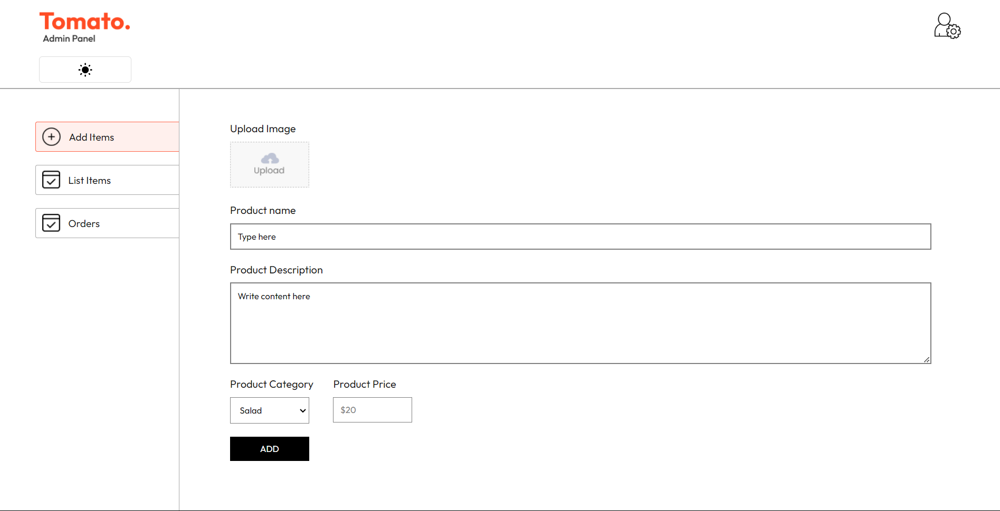

# FoodFast
This project is a comprehensive web application inspired by Zomato, designed to facilitate seamless online food ordering and delivery services. It features an intuitive admin panel for managing products and orders, a user-friendly interface for customers to browse menus, and a streamlined checkout process. With robust functionalities for product listings, order management, and delivery information, Tomato  aims to enhance the overall efficiency and user experience of online food services.

# Food Ordering App Screenshots

### 1.Homepage

This screenshot shows the menu page where users can explore a diverse array of dishes including salads, rolls, desserts, sandwiches, cakes, pure veg options, pasta, and noodles.

### 2.Menu Page

The homepage provides an option for users to order their favorite food. It includes a vibrant image of a dish and a call-to-action to view the menu. There's also a prompt to download the Tomato app for a better experience.

### 3. Login Page

The login page allows existing users to access their accounts. Users must enter their email and password to log in. There is also an option to agree to the terms of use and privacy policy.

### 4. Sign Up Page

The sign-up page enables new users to create an account. Users need to enter their name, email, and password. They must also agree to the terms of use and privacy policy to create an account.

### 5. Shopping Cart

- **Cart Items**:
  - Item Image
  - Title
  - Price
  - Quantity
  - Total
  - Remove Option

- **Cart Totals**:
  - Subtotal
  - Delivery Fee
  - Total
  - Promo Code Input

- **Actions**:
  - Proceed to Checkout Button

### 6. Delivery Information

- **Delivery Form**:
  - First Name
  - Last Name
  - Email Address
  - Street
  - City
  - State
  - Zip Code
  - Country
  - Phone

- **Cart Totals**:
  - Subtotal
  - Delivery Fee
  - Total

- **Actions**:
  - Proceed to Payment Button

### 7. Payment Page

This screenshot displays the payment page where users can complete their purchase. The example shows an order from Burger King with itemized costs and a form to enter payment details powered by Stripe.

### 8. Admin Panel

- **Add Items**: Form to add new products.
  - Upload Image
  - Product Name
  - Product Description
  - Product Category (Dropdown)
  - Product Price
  - Add Button

- **List Items**: View the list of available items.
- **Orders**: View and manage orders.

## Terms and Privacy

By using the platform, users agree to the terms of use and privacy policy, ensuring a secure and trustworthy environment for online food ordering.

## Contact
For any queries or support, please visit the [Portfolio](https://laxmikantportfolio-laxmikant-talakeris-projects.vercel.app/) page on our website.